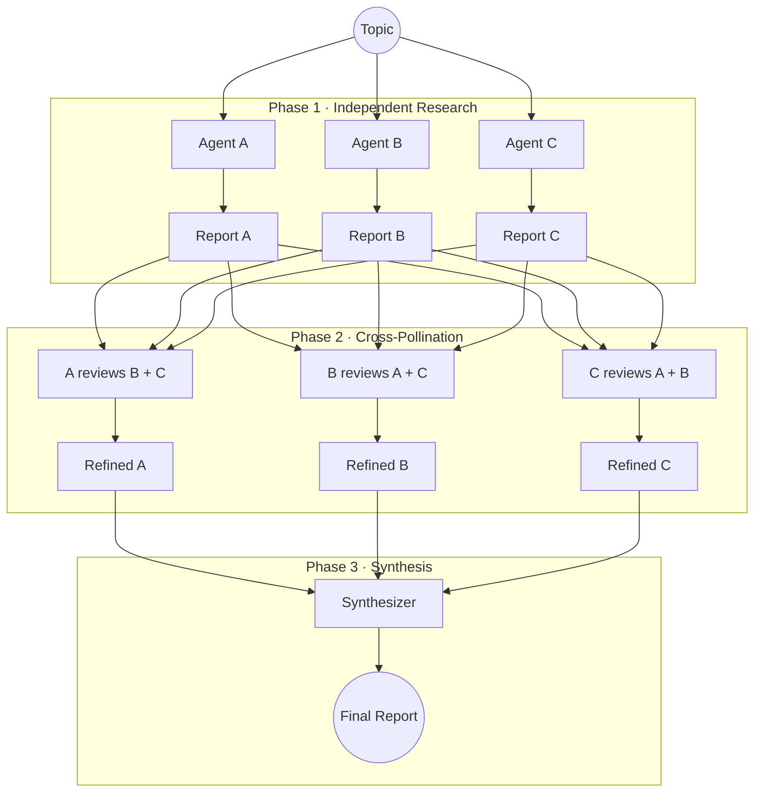
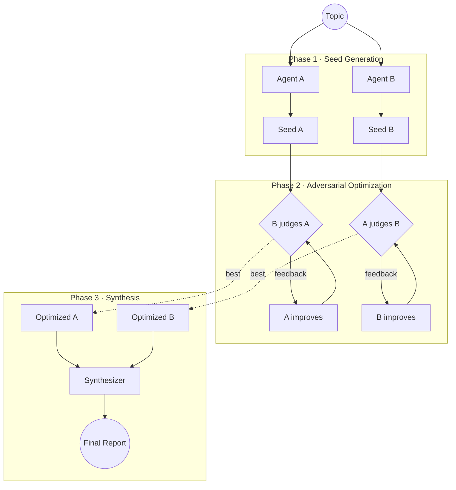

# ivory-tower

Multi-agent deep research from the terminal.

Orchestrates [counselors](https://github.com/anomalyco/counselors) agents to research a topic in parallel, challenge each other's work, and synthesize a final report.

Five strategies. **Council** and **adversarial** are battle-tested. **Debate**, **map-reduce**, and **red-blue** are implemented via the YAML template engine but not yet live-tested.

#### Council

Each agent researches independently, then skeptically cross-reviews every peer's report through new web searches, then a synthesizer merges the refined reports.



#### Adversarial

Two agents produce seed reports, then two parallel [GEPA](https://github.com/anomalyco/gepa) optimization loops run -- each agent iteratively improves its own report while the opposing agent scores it. A synthesizer merges the two battle-tested reports.



---

### Installation

```bash
# requires: python 3.12+, uv, counselors
uv tool install ivory-tower

# with adversarial strategy support (GEPA)
uv tool install "ivory-tower[adversarial]"
```

### Quick start

```bash
# council (default) -- 3 agents research, cross-review, then synthesize
ivory research "state of WebAssembly in 2026" \
  -a claude-opus,codex-5.3-xhigh,amp-deep \
  -s claude-opus

# adversarial -- 2 agents produce seed reports, iteratively optimize via GEPA judging
ivory research "state of WebAssembly in 2026" \
  --strategy adversarial \
  -a claude-opus,codex-5.3-xhigh \
  -s claude-opus \
  --max-rounds 5

# read topic from file, pipe from stdin
ivory research -f topic.md -a claude-opus,codex-5.3-xhigh -s claude-opus
cat topic.md | ivory research -a claude-opus,codex-5.3-xhigh -s claude-opus
```

### Strategies

| Strategy | Agents | Status | Description |
|----------|--------|--------|-------------|
| **council** | 2+ | stable | Independent research, skeptical cross-review, synthesis |
| **adversarial** | 2 | stable | Iterative optimization scored by opposing agent via [GEPA](https://github.com/anomalyco/gepa) |
| **debate** | 2-6 | alpha | Turn-based argumentation with shared blackboard transcript |
| **map-reduce** | 2-20 | alpha | Decompose topic into subtopics, one agent per subtopic, merge |
| **red-blue** | 3-10 | alpha | Red team critiques, blue team defends, synthesizer reconciles |

> Council and adversarial have custom Python implementations and have been live-tested. Debate, map-reduce, and red-blue run through the `GenericTemplateExecutor` (YAML-driven) and have unit/integration tests but no live runs yet.

Strategies are defined as YAML templates. Drop a `.yml` in `~/.ivory-tower/strategies/` to create your own, or pass `--template path/to/strategy.yml`.

### Commands

```
ivory research TOPIC [OPTIONS]    Run a research pipeline
ivory resume   RUN_DIR            Resume a partially-completed run
ivory status   RUN_DIR            Print status summary
ivory list                        List all runs in output directory
ivory strategies                  List available strategies
ivory templates                   List strategy templates
ivory profiles                    List agent profiles
ivory audit    RUN_DIR [AGENT]    Query sandbox audit trail
```

### Options

| Flag | Short | Description |
|------|-------|-------------|
| `--agents` | `-a` | Comma-separated agent IDs (required) |
| `--synthesizer` | `-s` | Agent ID for final synthesis (required) |
| `--strategy` | | Strategy name (default: `council`) |
| `--template` | `-t` | Strategy template (built-in name or YAML path) |
| `--file` | `-f` | Read topic from a file |
| `--instructions` | `-i` | Append custom instructions to the prompt |
| `--raw` | | Send topic as-is with no prompt wrapping |
| `--output-dir` | `-o` | Override output directory (default: `./research`) |
| `--max-rounds` | | Max GEPA optimization rounds (adversarial, default: 10) |
| `--rounds` | | Number of rounds for iterative phases |
| `--sandbox` | | Sandbox backend: `none`, `local`, `agentfs`, `daytona` |
| `--red-team` | | Agent specs for red team (red-blue strategy) |
| `--blue-team` | | Agent specs for blue team (red-blue strategy) |
| `--dry-run` | | Show the execution plan without running |
| `--json` | | Print manifest JSON on completion |
| `--verbose` | `-v` | Rich logging with animated spinners and debug output |

### Agent profiles

Reusable agent identities stored as YAML in `~/.ivory-tower/profiles/`:

```yaml
# ~/.ivory-tower/profiles/deep-researcher.yml
model: claude-opus
role: researcher
system_prompt: "You are a thorough researcher..."
```

Reference profiles on the CLI with `@name`:

```bash
ivory research "topic" -a @deep-researcher,@fast-scanner -s claude-opus
```

```bash
ivory profiles           # list all profiles
```

### Sandboxing

Agent isolation for template-based strategies (debate, map-reduce, red-blue). Four backends:

| Backend | Requires | Description |
|---------|----------|-------------|
| `none` | nothing | No isolation (default) |
| `local` | nothing | Directory-based isolation per agent |
| `agentfs` | [agentfs](https://agentfs.ai) CLI | SQLite copy-on-write filesystem with encryption and audit trail |
| `daytona` | [daytona](https://daytona.io) SDK | Full Docker container isolation with resource limits |

```bash
ivory research "topic" --template debate -a a,b,c -s a --sandbox local
```

> Sandbox support is wired into the template executor used by debate, map-reduce, and red-blue. Council and adversarial use direct filesystem paths and currently ignore `--sandbox`.

### Output

Each run produces a self-contained directory:

```
./research/20260301-143000-a1b2c3/
    manifest.json          # run metadata, timing, status
    topic.md               # original topic
    research-prompt.md     # generated prompt
    phase1/                # initial research / seed reports
    phase2/                # cross-review / optimization artifacts
    phase3/final-report.md # synthesized report
```

### Requirements

- Python 3.12+
- [uv](https://github.com/astral-sh/uv)
- [counselors](https://github.com/anomalyco/counselors) installed and configured with at least 2 agents
- [gepa](https://github.com/anomalyco/gepa) for the adversarial strategy (`uv tool install "ivory-tower[adversarial]"`)

### Inspired by

[hamelsmu/research-council](https://github.com/hamelsmu/research-council) · [counselors](https://github.com/anomalyco/counselors) · [GEPA](https://github.com/anomalyco/gepa) · [clig.dev](https://clig.dev/)
