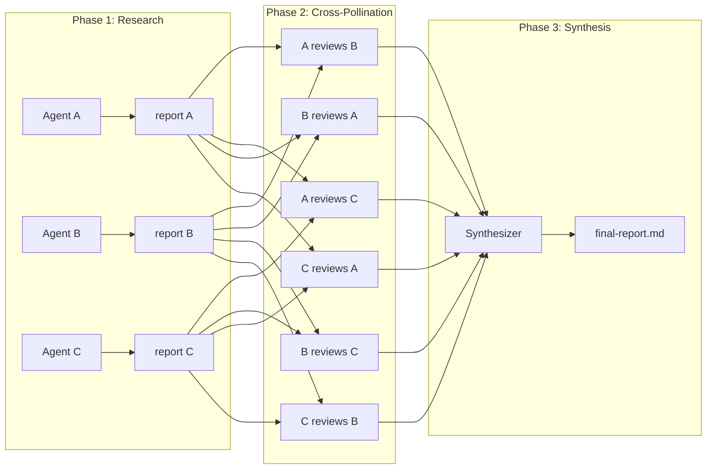

# ivory-tower

Multi-agent deep research from the terminal. Three phases: independent research, skeptical cross-pollination, synthesis.

Orchestrates [counselors](https://github.com/anomalyco/counselors) to fan out research across multiple AI agents, have them critique each other's work, then synthesize a final report.

---

### How it works



Agents independently research a topic, then skeptically verify each other's findings through new web searches, then a single synthesizer produces the final report.

### Installation

```bash
# requires: python 3.12+, uv, counselors
uv tool install ivory-tower
```

### Usage

```bash
# basic research
ivory research "state of WebAssembly in 2026" \
  --agents claude-opus,codex-5.3-xhigh,amp-deep \
  --synthesizer claude-opus

# from a markdown file
ivory research --file topic.md -a claude-opus,codex-5.3-xhigh -s claude-opus

# pipe from stdin
cat topic.md | ivory research -a claude-opus,codex-5.3-xhigh -s claude-opus

# dry run -- see the plan without executing
ivory research "topic" -a claude-opus,codex-5.3-xhigh -s claude-opus --dry-run

# add custom instructions to the auto-generated prompt
ivory research "topic" -a claude-opus,codex-5.3-xhigh -s claude-opus \
  --instructions "focus on cost implications and migration paths"

# send topic as-is (no prompt wrapping)
ivory research --file custom-prompt.md -a claude-opus -s claude-opus --raw

# resume an interrupted run
ivory resume ./research/20260301-143000-a1b2c3/

# check run status
ivory status ./research/20260301-143000-a1b2c3/

# list all runs
ivory list
```

### Output

```
./research/20260301-143000-a1b2c3/
    manifest.json
    topic.md
    phase1/
        claude-opus-report.md
        codex-5.3-xhigh-report.md
        amp-deep-report.md
    phase2/
        claude-opus-cross-codex-5.3-xhigh.md
        claude-opus-cross-amp-deep.md
        codex-5.3-xhigh-cross-claude-opus.md
        ...
    phase3/
        final-report.md
```

`manifest.json` tracks timing, status, and agent metadata for each phase.

### Requirements

- Python 3.12+
- [counselors](https://github.com/anomalyco/counselors) installed and configured with at least 2 agents
- [uv](https://github.com/astral-sh/uv) for installation

### Inspired by

- [hamelsmu/research-council](https://github.com/hamelsmu/research-council) -- multi-agent research workflow
- [counselors](https://github.com/anomalyco/counselors) -- parallel AI agent dispatch
- [clig.dev](https://clig.dev/) -- CLI design guidelines
