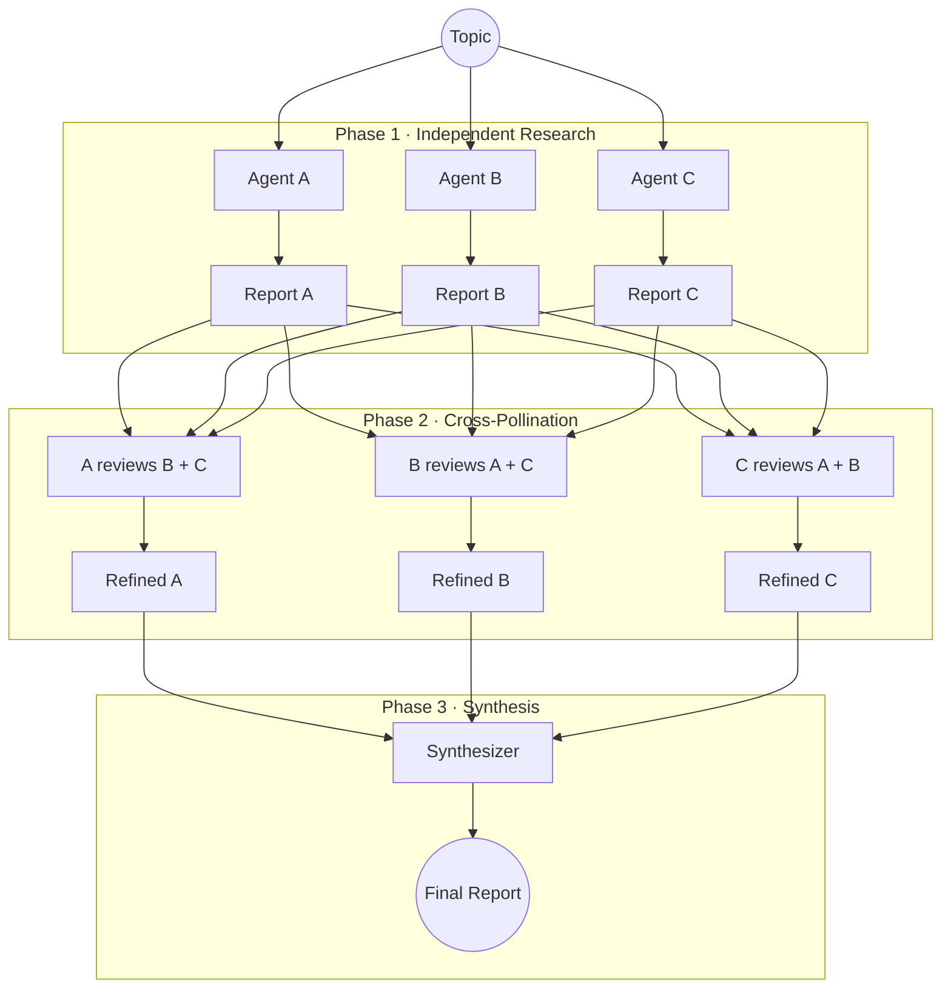
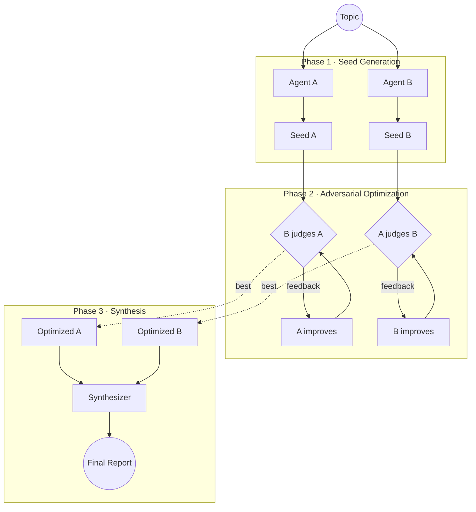

# ivory-tower

Multi-agent deep research from the terminal.

Orchestrates AI coding agents via [ACP](https://agentclientprotocol.com) (Agent Client Protocol) to research a topic in parallel, challenge each other's work, and synthesize a final report. Also supports headless CLI agents and legacy [counselors](https://github.com/anomalyco/counselors) as fallback.

Five strategies. **Council** and **adversarial** are battle-tested. **Debate**, **map-reduce**, and **red-blue** are implemented via the YAML template engine but not yet live-tested.

#### Council

Each agent researches independently, then skeptically cross-reviews every peer's report through new web searches, then a synthesizer merges the refined reports.



#### Adversarial

Two agents produce seed reports, then two parallel [GEPA](https://github.com/anomalyco/gepa) optimization loops run -- each agent iteratively improves its own report while the opposing agent scores it. A synthesizer merges the two battle-tested reports.



---

### Installation

```bash
# requires: python 3.12+, uv
uv tool install ivory-tower

# with adversarial strategy support (GEPA)
uv tool install "ivory-tower[adversarial]"

# with direct LLM executor (litellm) for adversarial evaluation
uv tool install "ivory-tower[direct]"

# everything
uv tool install "ivory-tower[all]"
```

### Agent Setup

Create YAML configs in `~/.ivory-tower/agents/`, one per agent. Agent names must match the filename.

```yaml
# ~/.ivory-tower/agents/opencode-haiku.yml
name: opencode-haiku
command: opencode           # binary on PATH
args: ["acp"]               # starts OpenCode in ACP mode
protocol: acp               # ACP over stdio (Tier 1)
env:
  OPENCODE_CONFIG_CONTENT: '{"model": "wibey/claude-haiku-4-5-20251001"}'
```

```yaml
# ~/.ivory-tower/agents/opencode-gpt.yml
name: opencode-gpt
command: opencode
args: ["acp"]
protocol: acp
env:
  OPENCODE_CONFIG_CONTENT: '{"model": "openai/gpt-5.3-codex-spark"}'
```

```yaml
# ~/.ivory-tower/agents/codex-headless.yml
name: codex-headless
command: codex
args: ["-m", "gpt-5.3-codex", "--quiet"]
protocol: headless           # non-ACP CLI (Tier 2)
output_format: text
```

Verify: `ivory agents`

### Quick start

```bash
# council (default) -- 2 agents research, cross-review, synthesize
ivory research "state of WebAssembly in 2026" \
  -a opencode-haiku,opencode-gpt \
  -s opencode-haiku

# with local sandboxing (each agent gets isolated workspace)
ivory research "topic" \
  -a opencode-haiku,opencode-gpt \
  -s opencode-haiku \
  --sandbox local -v

# adversarial -- iterative optimization scored by opposing agent via GEPA
ivory research "topic" \
  --strategy adversarial \
  -a opencode-haiku,opencode-gpt \
  -s opencode-haiku \
  --max-rounds 5

# adversarial with direct LLM executor (100% JSON parse reliability, no agent runtime)
ivory research "topic" \
  --strategy adversarial \
  --executor direct --model openai/claude-haiku-4-5 \
  -a agent-a,agent-b -s agent-a

# read topic from file
ivory research -f topic.md -a opencode-haiku,opencode-gpt -s opencode-haiku

# stream live agent output
ivory research "topic" -a opencode-haiku,opencode-gpt -s opencode-haiku --stream
```

### Strategies

| Strategy | Agents | Status | Description |
|----------|--------|--------|-------------|
| **council** | 2+ | stable | Independent research, skeptical cross-review, synthesis |
| **adversarial** | 2 | stable | Iterative optimization scored by opposing agent via [GEPA](https://github.com/anomalyco/gepa). Supports `--executor direct` for 100% JSON parse reliability via litellm. |
| **debate** | 2-6 | alpha | Turn-based argumentation with shared blackboard transcript |
| **map-reduce** | 2-20 | alpha | Decompose topic into subtopics, one agent per subtopic, merge |
| **red-blue** | 3-10 | alpha | Red team critiques, blue team defends, synthesizer reconciles |

> Council and adversarial have custom Python implementations and have been live-tested. Debate, map-reduce, and red-blue run through the `GenericTemplateExecutor` (YAML-driven) and have unit/integration tests but no live runs yet.

Strategies are defined as YAML templates. Drop a `.yml` in `~/.ivory-tower/strategies/` to create your own, or pass `--template path/to/strategy.yml`.

### Commands

```
ivory research TOPIC [OPTIONS]    Run a research pipeline
ivory resume   RUN_DIR            Resume a partially-completed run
ivory status   RUN_DIR            Print status summary
ivory list                        List all runs in output directory
ivory agents                      List configured agents (from ~/.ivory-tower/agents/)
ivory agents check NAME           Verify agent binary resolves and ACP handshake works
ivory migrate                     Show migration status from counselors to ACP
ivory strategies                  List available strategies
ivory templates                   List strategy templates
ivory profiles                    List agent profiles
ivory audit    RUN_DIR [AGENT]    Query sandbox audit trail
```

### Recovery and Checkpoints

Runs are resumable from `manifest.json` state. Recovery is phase-oriented (not
round-oriented).

```bash
# inspect current phase state
ivory status research/<run-id>

# resume from the first incomplete phase
ivory resume research/<run-id> -v
```

How resume works:

- If a phase is `complete`, resume skips it.
- If a phase is `pending`/`running`/`failed`, resume re-runs that phase from
  the phase start.
- For adversarial runs, this means optimization resumes at the phase level. If
  Phase 2 is incomplete, GEPA optimization is re-run for both seeds from their
  saved Phase 1 seed reports.

Common recovery flow after timeout/interruption:

1. Run `ivory status <run-dir>`.
2. Run `ivory resume <run-dir> -v`.
3. Verify `phase3/final-report.md` exists.

Notes:

- Resume is safe to retry; if an invocation fails transiently, run the same
  `ivory resume` command again.
- When using `--sandbox local`, isolation is directory-based plus ACP path
  checks. It is not OS-level jail isolation. For stronger containment, use
  `--sandbox agentfs` or `--sandbox daytona`.
- Some ACP agents may emit `external_directory` permission requests during
  tool use. These should not block successful completion when resume is retried,
  but they can produce noisy logs.

### Options

| Flag | Short | Description |
|------|-------|-------------|
| `--agents` | `-a` | Comma-separated agent IDs (required) |
| `--synthesizer` | `-s` | Agent ID for final synthesis (required) |
| `--strategy` | | Strategy name (default: `council`) |
| `--template` | `-t` | Strategy template (built-in name or YAML path) |
| `--file` | `-f` | Read topic from a file |
| `--instructions` | `-i` | Append custom instructions to the prompt |
| `--raw` | | Send topic as-is with no prompt wrapping |
| `--output-dir` | `-o` | Override output directory (default: `./research`) |
| `--max-rounds` | | Max GEPA optimization rounds (adversarial, default: 10) |
| `--rounds` | | Number of rounds for iterative phases |
| `--sandbox` | | Sandbox backend: `none`, `local`, `agentfs`, `daytona` |
| `--red-team` | | Agent specs for red team (red-blue strategy) |
| `--blue-team` | | Agent specs for blue team (red-blue strategy) |
| `--dry-run` | | Show the execution plan without running |
| `--json` | | Print manifest JSON on completion |
| `--stream` | | Stream live agent output to terminal (Rich Live panels) |
| `--executor` | | Executor for adversarial GEPA loop: `counselors` (default) or `direct` (litellm) |
| `--model` | | LLM model ID for direct executor (e.g., `openai/claude-haiku-4-5`) |
| `--api-base` | | API base URL for direct executor |
| `--parse-agent` | | Fallback agent for structured-output extraction when judge JSON parsing fails |
| `--verbose` | `-v` | Rich logging with animated spinners and debug output |

### Agent profiles

Reusable agent identities stored as YAML in `~/.ivory-tower/profiles/`. Profiles are distinct from agent configs -- they define persona/system prompt overlays, not execution binaries.

```yaml
# ~/.ivory-tower/profiles/deep-researcher.yml
role: researcher
system_prompt: "You are a thorough researcher..."
```

Reference profiles on the CLI with `@name`:

```bash
ivory research "topic" -a @deep-researcher,@fast-scanner -s opencode-haiku
```

```bash
ivory profiles           # list all profiles
```

### Sandboxing

Each agent runs in its own sandbox; shared state flows through orchestrator-mediated blackboards -- agents never write to shared volumes directly. All strategies (council, adversarial, template-based) support `--sandbox`.

For ACP agents, `SandboxACPClient` intercepts `readTextFile`/`writeTextFile`/`createTerminal` calls and routes them through the sandbox with path traversal prevention and isolation mode enforcement. For headless agents, isolation depends on the sandbox backend's OS-level enforcement.

#### Backends

| Backend | Requires | Isolation | Snapshots | Audit |
|---------|----------|-----------|-----------|-------|
| `none` | nothing | None -- all agents share the run directory (default) | -- | -- |
| `local` | nothing | Directory-based -- each agent gets `sandboxes/{agent}/workspace/` | -- | -- |
| `agentfs` | [agentfs](https://agentfs.ai) CLI | OS-level (FUSE/namespaces on Linux, NFS/sandbox-exec on macOS) with SQLite CoW filesystem | Yes | Yes |
| `daytona` | [daytona](https://daytona.io) SDK | Full Docker container with configurable CPU, memory, disk, and network policy | -- | -- |

#### High-level interfaces

Three `@runtime_checkable` protocols in `sandbox/types.py`:

- **`SandboxProvider`** -- Factory. Creates per-agent sandboxes and shared volumes. Implementations registered in `sandbox/__init__.py` as `{"none", "local", "agentfs", "daytona"}`.
- **`Sandbox`** -- An isolated workspace for one agent. Provides `execute()`, `read_file()`, `write_file()`, `copy_in()`, `copy_out()`, `snapshot()`, `diff()`, `destroy()`.
- **`SharedVolume`** -- A shared filesystem region mountable into multiple sandboxes. Provides `write_file()`, `read_file()`, `append_file()`, `list_files()`.

The `GenericTemplateExecutor` creates one sandbox per agent and one shared volume per blackboard, then runs phases in sequence. After each phase, `setup_phase_isolation()` copies data between sandboxes based on the phase's isolation mode:

| Isolation mode | Behavior |
|----------------|----------|
| `full` | No data exchange -- sandboxes are fully isolated |
| `read-peers` | Each agent receives peer outputs from a prior phase (excluding its own) |
| `read-all` | Every agent receives all outputs from specified input phases |
| `blackboard` | Current blackboard snapshot copied into each sandbox (read + append) |
| `read-blackboard` | Same as blackboard, but read-only intent |
| `team` | Team-internal shared volume files copied into each agent's sandbox |
| `cross-team-read` | Opposing team outputs copied into each agent's sandbox |

#### Blackboard pattern

Orchestrator-mediated shared state via `FileBlackboard` (`sandbox/blackboard.py`). Two modes:

- **Transcript mode** (`file:` set) -- single file, append-only. Each turn appends `## {agent} -- Round N`.
- **Directory mode** (`dir:` set) -- one file per contribution: `{round}-{agent}.md`.

Flow per round: orchestrator reads blackboard, writes snapshot into each sandbox, agents run, orchestrator reads outputs back, appends to blackboard. Agents see a consistent snapshot but never write directly.

#### Usage with strategies

```bash
# debate -- turn-based argumentation with shared blackboard transcript
ivory research "topic" --template debate \
  -a opencode-haiku,opencode-gpt,opencode-wibey-opus -s opencode-wibey-opus \
  --sandbox local --rounds 5

# map-reduce -- decompose, research subtopics in parallel, merge
ivory research "topic" --template map-reduce \
  -a opencode-haiku,opencode-gpt,opencode-wibey-opus -s opencode-wibey-opus \
  --sandbox agentfs

# red-blue -- adversarial team debate with cross-team isolation
ivory research "topic" --template red-blue \
  -a opencode-haiku,opencode-gpt,opencode-wibey-opus,opencode-gpt-codex \
  -s opencode-wibey-opus \
  --red-team opencode-haiku,opencode-gpt --blue-team opencode-wibey-opus,opencode-gpt-codex \
  --sandbox daytona

# query the sandbox audit trail (agentfs only)
ivory audit research/20260301-143000-a1b2c3/ opencode-haiku
```

YAML templates can declare sandbox defaults that `--sandbox` overrides:

```yaml
defaults:
  sandbox:
    backend: local
    snapshot_after_phase: true
    snapshot_on_failure: true
```

### Output

Each run produces a self-contained directory:

```
./research/20260301-143000-a1b2c3/
    manifest.json          # run metadata, timing, status
    topic.md               # original topic
    research-prompt.md     # generated prompt
    phase1/                # initial research / seed reports
    phase2/                # cross-review / optimization artifacts
    phase3/final-report.md # synthesized report
    sandboxes/             # per-agent isolated workspaces (with --sandbox local/agentfs/daytona)
      agent-a/workspace/   #   audit copies of agent file operations
      agent-b/workspace/
```

### Logging

All pipeline output flows through a single logging system built on Python's `logging` module with [Rich](https://github.com/Textualize/rich) rendering. Call `setup_logging()` once at CLI startup; every module then uses `logging.getLogger(__name__)`.

#### Architecture

```
src/ivory_tower/log.py          # shared console, symbols, formatters, spinners
    console                     # Rich Console(theme=_THEME, stderr=True)
    setup_logging()             # configures root logger with RichHandler
    fmt_phase / fmt_ok / ...    # markup formatters
    phase_spinner()             # context-manager spinner with auto-duration
    create_agent_progress()     # multi-agent progress bar
```

All logging goes to stderr via the shared themed `Console`. The `RichHandler` renders timestamps, levels, and Rich markup automatically. Third-party loggers (httpx, openai, anthropic, etc.) are quietened to WARNING.

#### Visual Language

Every strategy follows the same visual pattern:

```
[HH:MM:SS] INFO  ▶ Research Pipeline                    # engine header
[HH:MM:SS] INFO    ▸ Strategy: council
[HH:MM:SS] INFO    ▸ Agents: agent-a, agent-b
[HH:MM:SS] INFO    ▸ Synthesizer: synth
[HH:MM:SS] INFO    ▸ Topic: "..."
[HH:MM:SS] INFO    ▸ Run ID: 20260301-...

[HH:MM:SS] INFO  ▶ Phase 1 -- Independent Research      # phase header
[HH:MM:SS] INFO    ▸ Agents: agent-a, agent-b
              ▸ Agents researching: agent-a, agent-b     # animated spinner
              ✔ Agents researching: agent-a, agent-b (45.2s)
[HH:MM:SS] INFO  ✔ Phase 1 complete (45.2s)             # phase footer

[HH:MM:SS] INFO  ▶ Phase 2 -- Cross-Pollination
[HH:MM:SS] INFO    ▸ 2 agents refining reports concurrently
              agent-a refining... ████████████ 0:00:32   # progress bar
              ✔ agent-a refined (32.1s)
              ✔ agent-b refined (28.7s)
[HH:MM:SS] INFO  ✔ Phase 2 complete (32.1s)

[HH:MM:SS] INFO  ▶ Phase 3 -- Synthesis
[HH:MM:SS] INFO    ▸ Synthesizer: synth combining 2 refined reports
              ▸ Synthesizer synth working...
              ✔ Synthesizer synth working... (18.0s)
[HH:MM:SS] INFO  ✔ Phase 3 complete (18.0s) -- final report: 14832 bytes

[HH:MM:SS] INFO  ✔ Council pipeline complete (1m 35s)   # pipeline footer
```

#### Per-Strategy Logging

| Strategy | Pipeline Header | Phase Headers | Step Detail | Spinners/Progress | Phase Footers | Pipeline Footer |
|----------|----------------|---------------|-------------|-------------------|---------------|-----------------|
| **council** | `run()` | Each `_run_phase{1,2,3}` | Agent lists, ACP session info | `phase_spinner`, `create_agent_progress` | Duration per phase | Duration total |
| **adversarial** | `_run_adversarial_optimization` | Each `_run_*` method | Per-round scores, feedback, optimization progress | `phase_spinner` per judge/improve/optimize | Duration per phase | Duration total |
| **debate** | `run()` | `GenericTemplateExecutor` per phase | Agent lists, isolation mode, round counts | `phase_spinner` per agent turn | Duration per phase | Duration total |
| **map-reduce** | `run()` | `GenericTemplateExecutor` per phase | Agent lists, isolation mode, concurrency | `phase_spinner` for single-agent phases | Duration per phase | Duration total |
| **red-blue** | `run()` | `GenericTemplateExecutor` per phase | Team assignments, isolation mode | `phase_spinner` per agent turn | Duration per phase | Duration total |

Council and adversarial have custom Python logging at each step. Debate, map-reduce, and red-blue delegate phase execution to `GenericTemplateExecutor`, which logs phase headers/footers, round progress, agent dispatch, and timing for every phase defined in their YAML templates.

#### Log Levels

- `INFO` -- phase boundaries, scores, timing, completion messages. Visible by default.
- `DEBUG` -- JSON extraction strategies, proposer/evaluator internals, round-level file paths. Enable with `--verbose` / `-v`.
- `WARNING` -- parse failures, score 0.0 warnings, missing agent output, fallback paths.
- `ERROR` -- optimization failures with full tracebacks (when verbose).

#### Symbols

| Symbol | Name | Usage |
|--------|------|-------|
| `▶` | `SYM_PHASE` | Phase headers |
| `✔` | `SYM_OK` | Success / completion |
| `✘` | `SYM_FAIL` | Failure |
| `▸` | `SYM_ARROW` | Bullet / step detail |
| `★` | `SYM_SCORE` | Score display |
| `⟳` | `SYM_ROUND` | Round markers |
| `✦` | `SYM_SPARK` | Highlights |

#### Theme

Rich markup tags used in log messages:

| Tag | Style | Usage |
|-----|-------|-------|
| `[phase]` | bold cyan | Phase names, strategy headers |
| `[agent]` | bold magenta | Agent names |
| `[score]` | bold yellow | Scores, ratings |
| `[ok]` | bold green | Success markers |
| `[warn]` | bold yellow | Warnings |
| `[fail]` | bold red | Failures |
| `[dim]` | dim | Secondary info (run IDs, paths, topic previews) |
| `[duration]` | cyan | Timing values |

### Requirements

- Python 3.12+
- [uv](https://github.com/astral-sh/uv)
- At least 2 ACP-compatible agents on PATH (e.g., [OpenCode](https://github.com/anomalyco/opencode) with `opencode acp`)
- Agent configs in `~/.ivory-tower/agents/` (see Agent Setup above)
- Optional: [gepa](https://github.com/anomalyco/gepa) for adversarial strategy (`uv tool install "ivory-tower[adversarial]"`)
- Optional: [counselors](https://github.com/anomalyco/counselors) for legacy executor fallback

### Inspired by

[hamelsmu/research-council](https://github.com/hamelsmu/research-council) · [ACP](https://agentclientprotocol.com) · [counselors](https://github.com/anomalyco/counselors) · [GEPA](https://github.com/anomalyco/gepa) · [clig.dev](https://clig.dev/)
