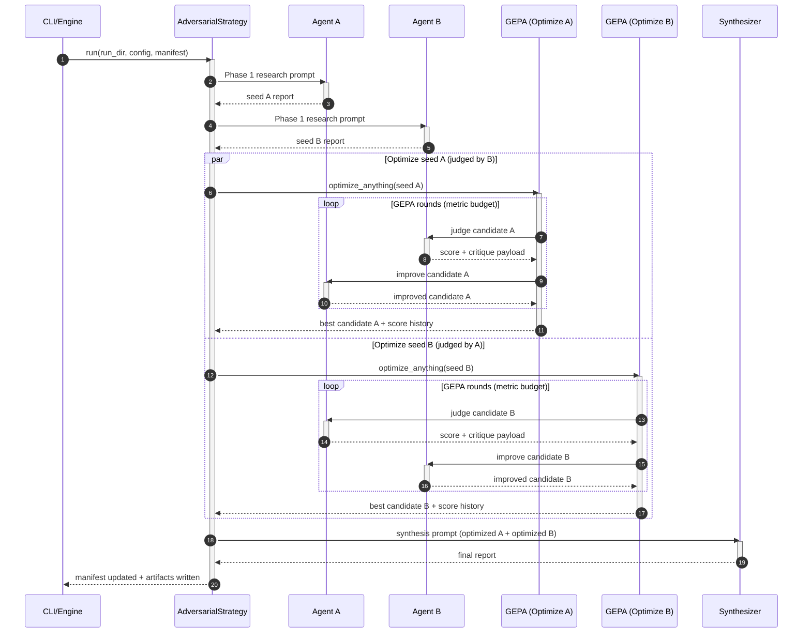
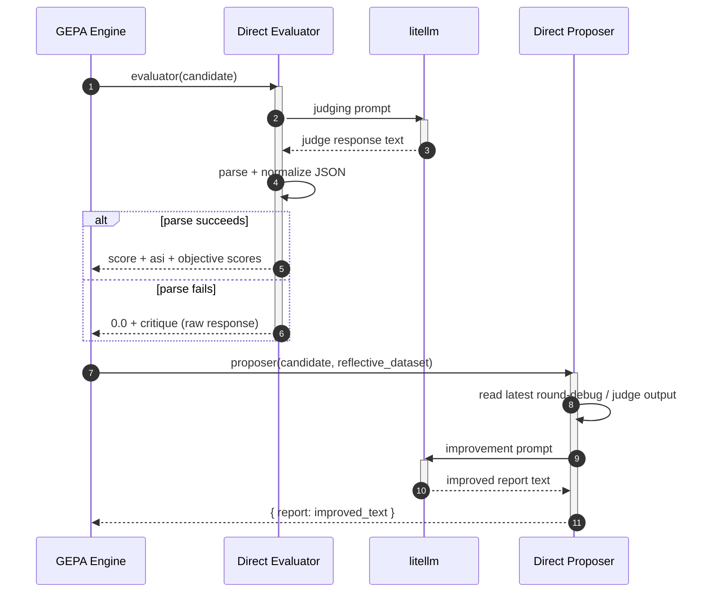
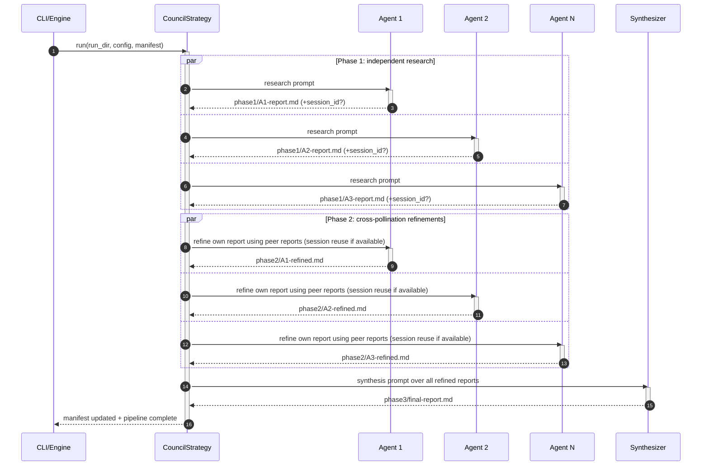
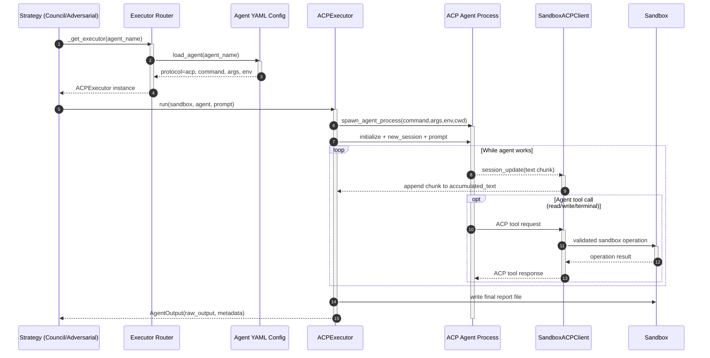

# Strategy and Execution Architecture

This document explains the main runtime architecture in user-friendly terms:

- Adversarial strategy (GEPA-based optimization)
- Council strategy (3-phase research pipeline)
- ACP-based executor interface for multiple codeact-style agents

Primary implementation files:
- `src/ivory_tower/strategies/adversarial.py`
- `src/ivory_tower/strategies/direct_llm.py`
- `src/ivory_tower/strategies/judge_scoring.py`
- `src/ivory_tower/prompts.py`

## What This Strategy Does

Adversarial strategy runs two agents against each other:

1. Both agents write initial seed reports.
2. GEPA optimizes each seed in parallel.
   - Agent A's report is judged by Agent B.
   - Agent B's report is judged by Agent A.
3. A synthesizer merges the two optimized reports into a final output.

The design goal is not just a higher single score, but stronger performance across multiple quality dimensions.

## End-to-End Lifecycle

### Phase 1: Seed Generation

- Prompt built with `build_research_prompt()`.
- Each agent runs through executor routing (`_get_executor()` + `_run_agent()`).
- Seed files are saved as `phase1/<agent>-seed.md`.

### Phase 2: Adversarial Optimization (GEPA)

- For each seed, the strategy calls `optimize_anything(...)`.
- Both seeds optimize concurrently using `ThreadPoolExecutor(max_workers=2)`.
- GEPA is configured with:
  - `frontier_type="objective"` (enables multi-objective Pareto behavior)
  - `max_metric_calls = 1 + max_rounds * 3`
  - `custom_candidate_proposer=<strategy proposer>`
  - `reflection_lm=<no-op callable>` (avoids unwanted default reflection model path)
- After optimization, best candidate is saved to `phase2/<agent>-optimized.md`.
- Per-agent logs are saved to `phase2/<agent>-optimization-log.json`.

### Phase 3: Synthesis

- Reads optimized reports (falls back to seeds if optimization artifacts are missing).
- Builds prompt via `build_adversarial_synthesis_prompt()`.
- Runs synthesizer agent and writes:
  - `phase3/<synthesizer>.md`
  - `phase3/final-report.md`

If a seed score is `0.0` (likely parse failure), that score label is omitted from synthesis prompt to avoid misleading the synthesizer.

## Core GEPA Loop (Default Agent-Executor Mode)

For one seed optimization task:

- Evaluator:
  - Sends candidate report to opposing judge agent.
  - Persists judge output to disk.
  - Parses structured feedback and score.
  - Injects `asi["scores"]` from dimension scores for GEPA objective frontier tracking.
  - Appends to `seed_result.dimension_history`.

- Proposer:
  - Uses disk-parsed judge feedback as ground truth (preferred over GEPA reflective dataset).
  - Builds improvement prompt with score trajectory and weakest-dimension focus.
  - Runs original agent to produce improved report.
  - Returns new candidate `{"report": improved_text}`.

This repeats until GEPA metric budget is consumed or GEPA converges.

## Judge Output Parsing and Fallback Chain

`parse_judge_output()` uses a layered fallback model:

1. JSON extraction from markdown/text using multiple regex strategies.
2. Optional parse-agent fallback (`--parse-agent`) via `_llm_extract_json()`.
3. Prose score extraction (`Overall Score: X/10` style patterns).
4. Final fallback: score `0.0`, keep raw output as critique.

Normalization is done by `normalize_judge_evaluation()` so both numeric and grade-based payloads can map into a deterministic score + ASI structure.

### Important nuance

In `_llm_extract_json()`, parse-agent output is currently accepted only if it includes `overall_score`. Grade-only parse-agent JSON may be rejected in that step even though the normalizer itself supports grade-based payloads.

## Direct LLM Mode (`--executor direct`)

When `config.executor == "direct"` in adversarial phase 2:

- Evaluator and proposer come from `direct_llm.py`.
- Judge and improvement calls go straight to `litellm` (`_llm_completion`) instead of agent executors.
- Feedback parsing uses `_parse_evaluation_json()` + `normalize_judge_evaluation()`.
- If parsing fails, score is `0.0` and critique keeps raw response text.

In this mode, `--parse-agent` fallback is not part of the direct evaluator path.

## Failure and Degradation Behavior

- GEPA exception for one seed: seed marked `PARTIAL` or `FAILED`, and seed report can be copied forward as optimized fallback.
- Judge parse failures: still preserve critique text so proposer can continue iterating.
- No improvement scenario: warnings are logged (especially repeated `0.0` trajectories).
- Overall optimization phase status:
  - `COMPLETE` if both seed optimizations complete.
  - `PARTIAL` if either seed path fails/partials.

## Key Artifacts You Can Inspect

- `phase1/<agent>-seed.md` - initial reports
- `phase2/judging/round-XX-<judge>-judges-<agent>/` - per-round judge inputs/outputs
- `phase2/<agent>-improve-round-XX/` - per-round improvement prompts/debug
- `phase2/<agent>-optimized.md` - best optimized report
- `phase2/<agent>-optimization-log.json` - score history and dimension history
- `phase3/final-report.md` - final synthesized report

## Example: Non-JSON Judge Output

Judge returns:

```text
The report is decent but undersourced.
Overall Score: 5.5/10
Main issue: no primary citations.
```

Result path:

- JSON extraction fails.
- If `--parse-agent fast-agent` is set, parse agent is invoked for structured extraction.
- If parse-agent fails, prose extraction recovers `5.5`.
- If prose extraction also fails, score becomes `0.0`, but critique text is still forwarded.

## Sequence Diagram: Full Adversarial Run



## Sequence Diagram: Judge Parse Fallback (Default Mode)

```mermaid
sequenceDiagram
autonumber
participant GEPA as GEPA Engine
participant EVAL as Evaluator
participant J as Judge Agent
participant PAR as parse_judge_output()
participant PA as Parse Agent (optional)
participant PROP as Proposer

GEPA->>EVAL: evaluator(candidate)
activate EVAL
EVAL->>J: run judge prompt
activate J
J-->>EVAL: raw judge output
deactivate J

EVAL->>PAR: parse_judge_output(round_dir, parse_agent?)
activate PAR
PAR->>PAR: Try JSON extraction + normalization
alt JSON parse succeeds
  PAR-->>EVAL: score + asi
else JSON parse fails and parse-agent configured
  PAR->>PA: _llm_extract_json(raw_text)
  activate PA
  PA-->>PAR: extracted JSON or failure
  deactivate PA
  alt parse-agent accepted
    PAR-->>EVAL: score + asi
  else parse-agent failed
    PAR->>PAR: prose score extraction
    alt prose score found
      PAR-->>EVAL: score_from_text + critique
    else no score signal
      PAR-->>EVAL: 0.0 + raw critique
    end
  end
else JSON parse fails and no parse-agent
  PAR->>PAR: prose score extraction
  alt prose score found
    PAR-->>EVAL: score_from_text + critique
  else no score signal
    PAR-->>EVAL: 0.0 + raw critique
  end
end
deactivate PAR

EVAL->>PROP: feedback for improvement prompt
deactivate EVAL
```

## Sequence Diagram: Direct LLM Mode (No Parse-Agent Path)



## Council Strategy Architecture

Council is the original 3-phase pipeline and is simpler than adversarial:

1. Independent research (all agents in parallel)
2. Cross-pollination (each agent refines its report by reviewing peers)
3. Synthesis (one synthesizer combines all refined reports)

Implementation file:
- `src/ivory_tower/strategies/council.py`

### Phase 1: Independent Research

- Builds one research prompt with `build_research_prompt()`.
- Runs every agent concurrently via `_get_executor()` + `_run_agent()`.
- Writes canonical outputs to `phase1/<agent>-report.md`.
- Captures `session_id` (if provided by executor metadata) for optional context reuse in Phase 2.

### Phase 2: Cross-Pollination

- For each agent:
  - Reads its own Phase 1 report.
  - Reads all peer reports.
  - Builds a refinement prompt with `build_refinement_prompt()`.
  - Runs refinement through the same executor abstraction.
- Writes `phase2/<agent>-refined.md`.
- Runs all refinements in parallel.

### Phase 3: Synthesis

- Reads all refined reports from `phase2/`.
- Builds synthesis prompt with `build_synthesis_prompt()`.
- Runs synthesizer agent and writes `phase3/final-report.md`.

### Council Artifacts

- `research-prompt.md`
- `phase1/<agent>-report.md`
- `phase2/<agent>-refined-prompt.md`
- `phase2/<agent>-refined.md`
- `phase3/synthesis-prompt.md`
- `phase3/final-report.md`

### Sequence Diagram: Council End-to-End



## ACP as a Unified Interface for Multiple Codeact Agents

Ivory-tower does not hardcode one agent runtime. It uses a protocol-driven executor layer:

- Agent YAML (`~/.ivory-tower/agents/<name>.yml`) declares `protocol`.
- `get_executor_for_agent()` maps protocol -> executor implementation.
- Strategies call `_run_agent(...)` against the `AgentExecutor` protocol, so they are runtime-agnostic.

Key files:
- `src/ivory_tower/agents.py`
- `src/ivory_tower/executor/__init__.py`
- `src/ivory_tower/executor/types.py`
- `src/ivory_tower/executor/acp_exec.py`
- `src/ivory_tower/acp_client.py`

### Supported Protocol Paths

- `acp` -> `ACPExecutor` (native ACP over stdio; preferred)
- `headless` -> `HeadlessExecExecutor` (structured CLI output parsing)
- `counselors` / `legacy-counselors` -> `CounselorsExecutor` (compat)
- `direct` -> `DirectExecutor` (litellm API; no runtime process)

### Why ACP Matters Here

- Uniform interface across different codeact-style agents that can speak ACP.
- Streaming output via session updates (`AgentMessageChunk`).
- Tool calls are mediated by `SandboxACPClient`, not trusted directly:
  - file reads/writes route through sandbox APIs
  - terminal commands route through sandbox execution
  - path traversal and isolation checks are enforced centrally

This lets strategies remain stable while swapping agent implementations.

### Sequence Diagram: ACP Invocation and Tool Mediation


